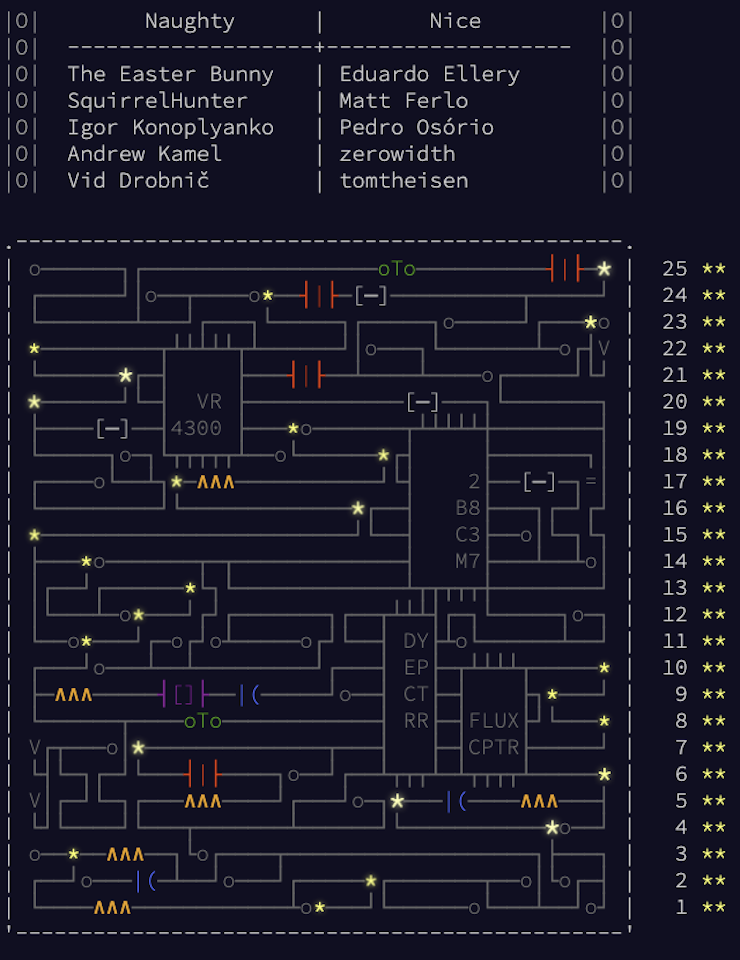

# [Advent of Code 2017](https://adventofcode.com/2017)

My answers for Advent of Code 2017.[^disclaimer]

## Introduction

### Language, Libraries and Frameworks

Language of choice: [Java](https://en.wikipedia.org/wiki/Java_(programming_language))

* [Java 17 - History of Java](https://en.wikipedia.org/wiki/Java_(software_platform)#Java_versions)
* [Gradle](https://gradle.org/)
* [JUnit](https://junit.org/)
* [JaCoCo](https://www.eclemma.org/jacoco/)

### History

I actually started Advent of Code in 2017 using Java. I decided to do the previous 2 years (2015, 2016) in Python to practice a bit and because it is the go-to language used by most of the competitive programmers that I follow. Don't get me wrong here, I'm _super slow_, but it does not prevent me from enjoying these incredibly fast programmers and watch them solve things. I'm here for the fun of it, not to win any contest. :smile:

ADD JAVA REFACTORING TEXT HERE

### Previous Editions

| Year                                  | Repository | Language |
|---------------------------------------| ---------- | -------- |
| [2015](https://adventofcode.com/2015) | [eduellery/aoc-2015](https://github.com/eduellery/aoc-2015) | Python | 
| [2016](https://adventofcode.com/2016) | [eduellery/aoc-2016](https://github.com/eduellery/aoc-2016) | Python | 

## Problems, Solutions and Blog Posts

| Problem | Solution | Blog Post |
| ------- | -------- | --------- |

<!--- advent_readme_stars table --->
## 2017 Results

| Day | Part 1 | Part 2 |
| :---: | :---: | :---: |
| [Day 1](https://adventofcode.com/2017/day/1) | ⭐ | ⭐ |
| [Day 2](https://adventofcode.com/2017/day/2) | ⭐ | ⭐ |
| [Day 3](https://adventofcode.com/2017/day/3) | ⭐ | ⭐ |
| [Day 4](https://adventofcode.com/2017/day/4) | ⭐ | ⭐ |
| [Day 5](https://adventofcode.com/2017/day/5) | ⭐ | ⭐ |
| [Day 6](https://adventofcode.com/2017/day/6) | ⭐ | ⭐ |
| [Day 7](https://adventofcode.com/2017/day/7) | ⭐ | ⭐ |
| [Day 8](https://adventofcode.com/2017/day/8) | ⭐ | ⭐ |
| [Day 9](https://adventofcode.com/2017/day/9) | ⭐ | ⭐ |
| [Day 10](https://adventofcode.com/2017/day/10) | ⭐ | ⭐ |
| [Day 11](https://adventofcode.com/2017/day/11) | ⭐ | ⭐ |
| [Day 12](https://adventofcode.com/2017/day/12) | ⭐ | ⭐ |
| [Day 13](https://adventofcode.com/2017/day/13) | ⭐ | ⭐ |
| [Day 14](https://adventofcode.com/2017/day/14) | ⭐ | ⭐ |
| [Day 15](https://adventofcode.com/2017/day/15) | ⭐ | ⭐ |
| [Day 16](https://adventofcode.com/2017/day/16) | ⭐ | ⭐ |
| [Day 17](https://adventofcode.com/2017/day/17) | ⭐ | ⭐ |
| [Day 18](https://adventofcode.com/2017/day/18) | ⭐ | ⭐ |
| [Day 19](https://adventofcode.com/2017/day/19) | ⭐ | ⭐ |
| [Day 20](https://adventofcode.com/2017/day/20) | ⭐ | ⭐ |
| [Day 21](https://adventofcode.com/2017/day/21) | ⭐ | ⭐ |
| [Day 22](https://adventofcode.com/2017/day/22) | ⭐ | ⭐ |
| [Day 23](https://adventofcode.com/2017/day/23) | ⭐ | ⭐ |
| [Day 24](https://adventofcode.com/2017/day/24) | ⭐ | ⭐ |
| [Day 25](https://adventofcode.com/2017/day/25) | ⭐ | ⭐ |
<!--- advent_readme_stars table --->

## Other

### Advent of Code 2017 Final Art

[^disclaimer]: **Disclaimer**: I do AoC for fun and to learn new languages and new tricks. Part of my learning process (also for fun, even if I
already have experience with some language), is to check what other users do and learn things from them. I can't help but incorporate
their cool, clean, concise ideas into my code. Sometimes their code is *so* much better than mine that I end up replacing my whole code!
So I *do* come up with answers on my own, but I can't claim being the author of anything here - I'm not tracking what is mine and what I replaced. 🤷🏽‍
